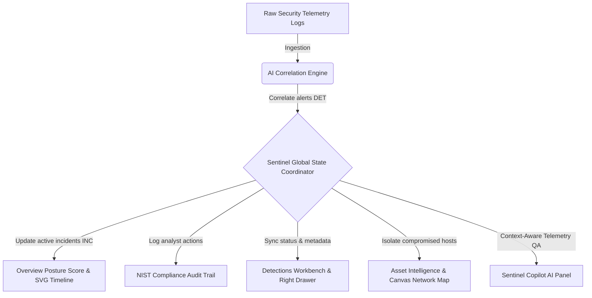

# 🛡️ Sentinel AI — Security Operations & AI-Driven Threat Detection Platform

[](https://clpueahb5dm2qwgvpnj3j4.streamlit.app/)

Sentinel AI is a modern, high-performance, AI-native Security Operations Center (SOC) dashboard. It transforms complex, multi-stage cybersecurity telemetry into clean, actionable, and visually rich security narratives.

Designed to avoid the visual clutter of traditional dashboards, Sentinel AI prioritizes analyst efficiency through a polished dark-mode interface, glassmorphism containers, animated network topologies, and a context-aware AI Security Copilot.

---

## 🏗️ Platform Architecture & Telemetry Flow

The following diagram illustrates how telemetry is ingested, correlated by the AI engine, mapped to the state coordinator, and visualised across modules:



---

## 🌟 Premium Features & Capabilities

### 1. Unified Security Health Gauge
- **Dynamic Risk Evaluation**: Calculates a security score (0-100) dynamically. Active critical incidents reduce posture index (Critical = -12, High = -6). The gauge is rendered as a vector SVG ring that shifts color dynamically (Green/Cyan for healthy, Amber for warning, Red for critical threat).

### 2. SVG Telemetry Timeline & Cross-Filtering
- **Forensic Graph**: Maps all detected security events on a 24-hour coordinate grid. Hovering over a dot highlights detailed metadata. Clicking a dot slides open the inspection panel.
- **Cross-Filtering**: Clicking metrics cards or category bars (e.g. *Credential Abuse*) filters the primary Threat Detection table instantly and redirects the view.

### 3. Progressive Reveal Attack Timelines
- Displays critical incident streams chronologically. Analysts see a simplified story by default but can click any timeline event to progressively reveal system-level process arguments, parent PIDs, and execution commands.

### 4. Interactive Canvas Network Map
- Renders relationship lines between **Users ➔ Devices ➔ Applications ➔ Servers ➔ External Connections**.
- Uses an HTML5 `<canvas>` with animated traffic particles. Egress exfiltration nodes (such as the connection from production databases to Dutch hosting block IPs) pulse in warnings.
- Allows dragging nodes to rearrange layouts, selecting nodes to review details in the Node Inspector, and triggering network containment.

### 5. Sentinel Copilot Chat
- A dedicated chat sidebar that queries active incident databases.
- Answers questions like *"What assets are affected?"*, *"Why was this detected?"*, or *"Show related events"* in markdown.
- Renders clickable citation chips `[DET-2026-103]` that instantly open the corresponding forensic alert drawer.

### 6. Auditor compliance Logger
- To satisfy NIST PR.AC-1 and ISO 27001 guidelines, the platform records every analyst action (firewall isolations, rule edits, status changes, and user roles) in the Auditor Audit Logs workspace.

---

## 📂 Codebase Directory Structure

```
workspace/
├── index.html                  # Single-page interface shell & modals
├── index.css                   # CSS Design Token stylesheet (Glassmorphism & animations)
├── app.js                      # Core coordinator initializing panels & router
├── server.ps1                  # Native Windows .NET web server script
├── app.py                      # Streamlit wrapper container
├── requirements.txt            # Python requirements configuration
├── package.json                # Node.js live-server configurations
└── src/
    ├── data.js                 # Realistic mock threat telemetry
    ├── state.js                # Global State coordinator (Pub/Sub design)
    └── components/
        ├── sidebar.js          # Collapsible navigation sidebar
        ├── dashboard.js        # Posture score ring, SVG timeline, & widgets
        ├── detections.js       # Detections list table & slide-out drawer
        ├── investigation.js    # Incident tabs, attack timelines, & notes
        ├── copilot.js          # AI Copilot QA panel & citations
        ├── assets.js           # Server metadata & containment rules
        ├── network.js          # Canvas force-directed topology map
        ├── rules.js            # Sigma/YARA rule database editor
        ├── reports.js          # Compliance PDF summary reports
        ├── notifications.js    # Notification popover dropdown
        ├── commands.js         # Ctrl+K global search command palette
        └── utils.js            # Shared toasts, relative timers, & CSV exports
```

---

## 🚀 Execution & Launch Modes

The application is fully client-side and requires no compile time. Choose one of four ways to launch it:

### Mode A: Zero-Dependency Static File (Local View)
Double-click [**`index.html`**](./index.html) in your file explorer. It opens instantly in your default browser.

### Mode B: Node.js Dev Server
If Node.js is installed, run:
```bash
npm install
npm run dev
```
Serves the platform at `http://localhost:8000/`.

### Mode C: Python Streamlit
If Python is installed, run:
```bash
pip install -r requirements.txt
streamlit run app.py
```
Hosts the container at `http://localhost:8501/`.

### Mode D: Native Windows Server (PowerShell)
If neither Python nor Node is installed, launch this built-in PowerShell server:
```powershell
powershell -ExecutionPolicy Bypass -File server.ps1
```
Serves the platform at `http://localhost:8000/`.
